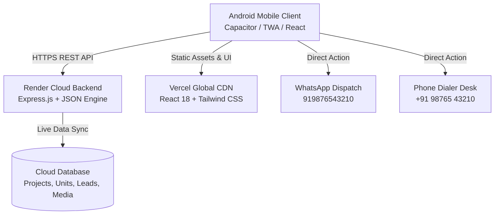

# 📱 Hariom Buildhomes — Android Mobile Application Documentation & Publishing Guide

> **Project Name**: Hariom Buildhomes Android Mobile Application  
> **Target Platforms**: Android (OS 8.0+ / API Level 26 - 35)  
> **App Version**: 1.0.0 (Build 1)  
> **Package ID / Application ID**: `com.hariombuildhomes.app`  
> **Developer / Builder**: Hariom Buildhomes (Led by Jitendra Kumawat)  
> **Official Contact**: `+91 98765 43210` | `sales@hariombuildhomes.com`  
> **Headquarters**: Vaishali Nagar, Jaipur, Rajasthan 302021  
> **Live API Backend**: `https://hariom-adku.onrender.com/api`  

---

## 1. 🏗️ Executive Summary & Architecture Overview

The **Hariom Buildhomes Android Mobile Application** provides a unified mobile experience for both property buyers (Public Catalog, HD Floor Plans, Live Construction Progress Tracker, 1-Click WhatsApp Enquiry) and company leadership/sales agents (Admin CMS & CRM Dashboard, Real-Time Unit Availability Changer, Leads Management).



### Technology Stack
- **Frontend Core**: React 18, Vite 5, Tailwind CSS, Lucide Icons.
- **Mobile Runtime Bridge**: **Capacitor 6.x (Native Android Wrapper)** or **Trusted Web Activity (TWA / Bubblewrap)**.
- **Backend API**: Node.js Express REST API hosted on Render Cloud.
- **Push Notifications (Optional)**: Firebase Cloud Messaging (FCM) / OneSignal.

---

## 2. 🌟 Core Mobile App Features

### A. Customer & Homebuyer Module
1. **🏠 Interactive Home Showcase**:
   - Touch-optimized banner slider showcasing featured residential landmarks.
   - 15+ Years Trust, 100+ Happy Families milestone counters.
   - Ongoing (🟢), Ready to Move (🔵), and Upcoming (🟡) project filters.
2. **📄 Detailed Project Explorer**:
   - Interactive zoomable **HD Floor Plans** (2 BHK, 3 BHK, 4 BHK, Luxury Villas).
   - **Live Construction Progress Tracker**: Real-time % progress bar, stage milestone checklist (Foundation ➔ Structure ➔ Finishing ➔ Handover), and monthly on-site photo logs.
   - **Location Distance Matrix**: Map routes and driving distances to Airport, Railway Station, Metro, and Top Schools in Jaipur.
3. **🔑 Real-Time Inventory (Ready to Move)**:
   - Unit-by-unit availability (House No., BHK, Facing, Floor, Price).
   - Live status badges: 🟢 *Available*, 🟡 *On Hold*, 🔴 *Sold Out*.
4. **📞 1-Tap Communication**:
   - Direct-to-WhatsApp pre-filled site visit booking.
   - 1-Tap native dialer trigger to sales desk (`+91 98765 43210`).

### B. Leadership & Admin CRM Module (`/admin`)
1. **🔐 Biometric / Secure PIN & Password Login**:
   - Username: `admin` | Password: `Jaipur@1212`.
2. **📊 Mobile Admin Dashboard**:
   - Live counters of Available Units, Sold Units, and New Customer Leads.
3. **🏠 1-Click Inventory Status Toggle**:
   - Switch unit status from `Available` ➔ `Sold` instantly on-site during customer meetings.
4. **📩 Instant Lead CRM**:
   - Real-time lead notifications when a customer submits an enquiry.
   - Pipeline manager: `New` ➔ `Contacted` ➔ `Site Visit Scheduled` ➔ `Converted`.
   - CSV Export directly to Android Downloads folder.

---

## 3. 🛠️ Step-by-Step Android APK Generation Guide

You can turn the existing project into a standalone `.apk` file using **Capacitor** in 4 simple commands:

### Prerequisites:
- Node.js (v18+)
- [Android Studio](https://developer.android.com/studio) installed on your PC.

### Step 1: Install Capacitor in the Client Directory
Open your terminal in the project folder and run:
```bash
cd client
npm install @capacitor/core @capacitor/cli @capacitor/android
npx cap init "Hariom Buildhomes" "com.hariombuildhomes.app" --web-dir dist
```

### Step 2: Build the Web Assets & Add Android Platform
```bash
npm run build
npx cap add android
```

### Step 3: Open in Android Studio & Build APK
```bash
npx cap open android
```
1. Android Studio will open automatically.
2. Go to **Build ➔ Build Bundle(s) / APK(s) ➔ Build APK(s)**.
3. Android Studio will generate the debug APK at:  
   `android/app/build/outputs/apk/debug/app-debug.apk`
4. Copy this `.apk` to any Android phone and install it immediately!

---

## 4. 🏪 Google Play Store Listing & Metadata Kit

### 1. App Identity
- **App Name (Title)**: `Hariom Buildhomes: Real Estate & Construction` (38 / 50 characters)
- **Short Description**:  
  *सुरक्षित, आधुनिक और प्रीमियम घर। Jaipur's trusted home builder with live construction tracking & verified properties.* (79 / 80 characters)
- **Category**: Real Estate / Business / House & Home
- **Content Rating**: Everyone (3+)
- **Primary Language**: Hindi (hi-IN) / English (en-IN)

### 2. Full Description (Google Play Store SEO Optimized)

```text
🏠 हरिओम बिल्डहोम्स (Hariom Buildhomes) — आपके सपनों का घर, सुरक्षित और आधुनिक लोकेशन पर!

15+ वर्षों के भरोसे और 100+ खुशहाल परिवारों के साथ, Hariom Buildhomes जयपुर में प्रीमियम विला, आधुनिक अपार्टमेंट्स और आवासीय प्रोजेक्ट्स के निर्माण में एक अग्रणी नाम है।

📱 Hariom Buildhomes आधिकारिक ऐप की मुख्य विशेषताएं:

✨ एक्सप्लोर करें प्रीमियम प्रोजेक्ट्स:
• Ongoing Construction, Ready to Move और Upcoming प्रोजेक्ट्स की विस्तृत जानकारी।
• 2 BHK, 3 BHK, 4 BHK लग्जरी विला और फ्लैट्स के HD फ्लोर प्लान्स।
• RERA अप्रूव्ड व 100% लीगल क्लियर टाइटल प्रॉपर्टीज।

🚧 लाइव कंस्ट्रक्शन प्रोग्रेस ट्रैकर (Live Progress):
• अपने घर के निर्माण की हर महीने की लाइव प्रगति (0-100%) देखें।
• फाउंडेशन, स्ट्रक्चर, स्लैब, ब्रिकवर्क और फिनिशिंग स्टेज की ऑनसाइट तस्वीरें।
• पूरी पारदर्शिता के साथ घर बैठे पजेशन टाइमलाइन ट्रैक करें।

🔑 रीयल-टाइम मकान इन्वेंट्री (Unit Status):
• कौन सा मकान उपलब्ध है (Available) और कौन सा बुक हो चुका है (Sold), लाइव देखें।
• कीमत, कार्पेट एरिया, दिशा (Vastu Facing) और फ्लोर की पूरी जानकारी।

📍 लोकेशन व कनेक्टिविटी (Location & Distances):
• जयपुर के प्रमुख लैंडमार्क्स, हाईवे, रेलवे स्टेशन, एयरपोर्ट, स्कूल और अस्पतालों की सटीक दूरियां।

📞 1-क्लिक साइट विजिट व संपर्क:
• सीधे WhatsApp या फोन कॉल के जरिए फ्री साइट विजिट बुक करें।
• प्रोजेक्ट सलाहकार से तुरंत मार्गदर्शन प्राप्त करें।

🏢 कॉर्पोरेट ऑफिस:
Vaishali Nagar, Jaipur, Rajasthan 302021
📞 हेल्पलाइन / WhatsApp: +91 98765 43210
🌐 वेबसाइट: https://hariombuildhomes.com
```

---

## 5. 🎨 Graphic Assets Specification for Google Play Store

| Asset Type | Dimension | Format | Notes |
|---|---|---|---|
| **App Icon** | 512 x 512 px | 32-bit PNG (No alpha) | Hariom Buildhomes Golden Luxury Logo with dark background |
| **Feature Graphic Banner** | 1024 x 500 px | JPG or 24-bit PNG | Project elevation photo with tagline *"आपके सपनों का घर"* |
| **Phone Screenshots** | Minimum 4 (1080 x 1920 px or 1080 x 2400 px) | PNG / JPG | 1. Home Showcase<br>2. Project Details & HD Floor Plan<br>3. Live Construction Tracker<br>4. Ready to Move Inventory |

---

## 6. 🔒 Privacy Policy Template (Google Play Requirement)

```markdown
# Privacy Policy for Hariom Buildhomes Mobile Application
**Effective Date**: September 2026  
**Developer**: Hariom Buildhomes, Jaipur, Rajasthan.  

Hariom Buildhomes respects your privacy and is committed to protecting any personal information you provide while using our mobile application and services.

### 1. Information We Collect
- **Contact Information**: When you submit a project enquiry or schedule a free site visit, we may collect your Name, Mobile Number, Email Address, and Preferred Visit Date.
- **Device Information**: Non-identifiable technical data such as operating system version and crash logs to ensure app performance.

### 2. How We Use Your Information
- To contact you regarding property enquiries, floor plans, brochures, and site visits.
- To dispatch construction updates and project handover notifications via WhatsApp or SMS.
- We **NEVER** sell, rent, or trade your personal data to third parties.

### 3. Data Security
All communication between the mobile app and our servers uses secure 256-bit SSL encryption (HTTPS).

### 4. Contact Our Privacy Desk
If you have questions regarding this Privacy Policy, contact us at:
- **Email**: sales@hariombuildhomes.com
- **Phone**: +91 98765 43210
- **Address**: Vaishali Nagar, Jaipur, Rajasthan 302021
```

---

## 7. 🚀 Google Play Console Submission Checklist

- [ ] Google Play Developer Account created ($25 one-time registration fee).
- [ ] Signed Release Android App Bundle (`.aab`) generated using Android Studio Keystore.
- [ ] App Icon (512x512) and Feature Graphic (1024x500) uploaded.
- [ ] At least 4 High-Resolution Screenshots uploaded.
- [ ] Privacy Policy URL hosted (e.g. `https://hariombuildhomes.com/privacy` or GitHub Pages).
- [ ] Content Rating Questionnaire completed (Rating: Everyone 3+).
- [ ] Target Audience set to 18+ (Property Buyers / Investors).
- [ ] App Access set to: "All functionality is available without special access".
- [ ] Submit for Closed/Open Testing ➔ Production Release!
